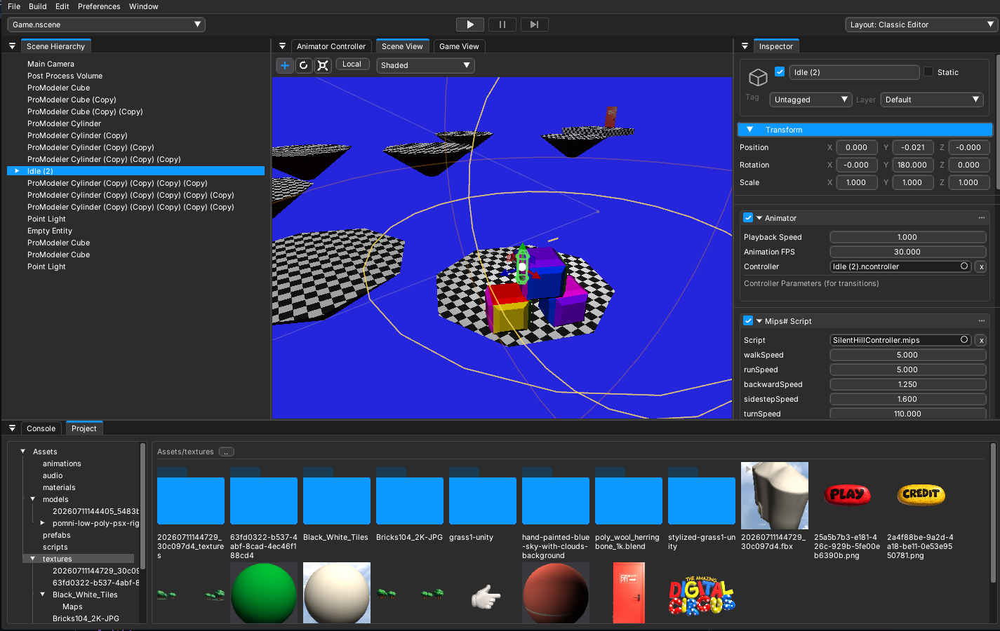
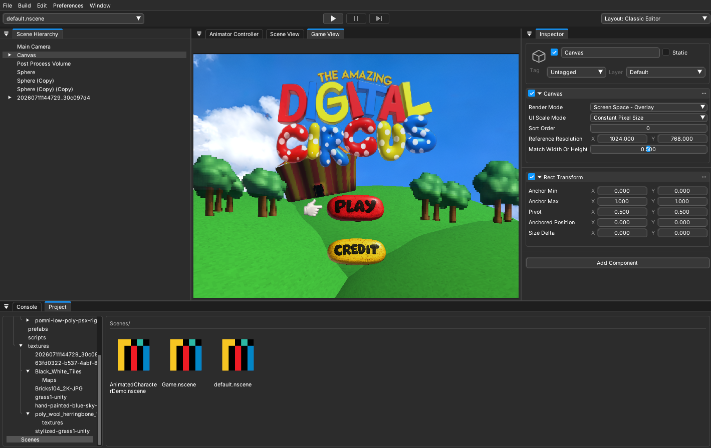
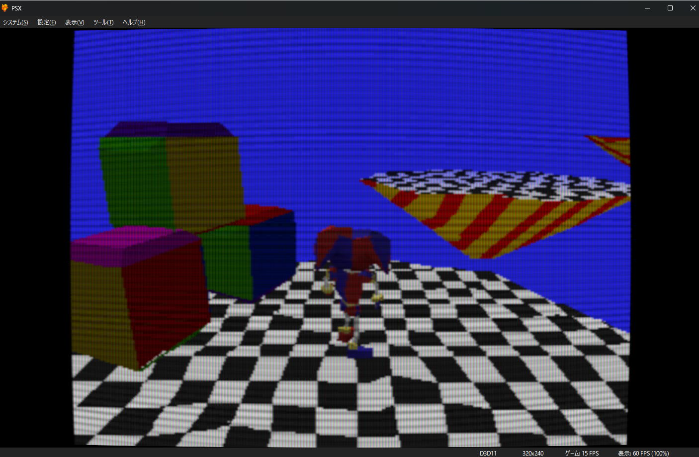
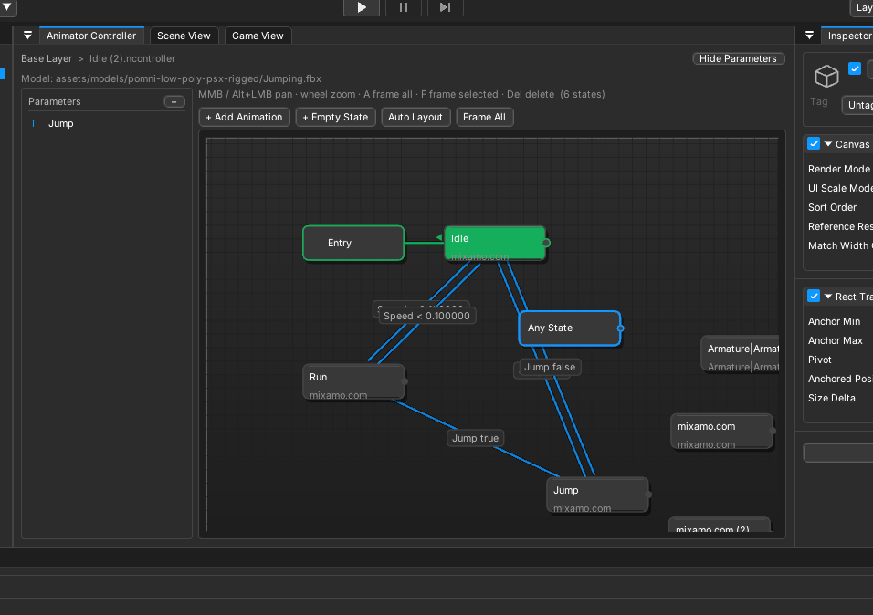

<p align="center">
  
</p>

<p align="center">
  <strong>A modern game editor for building games that run on the original PlayStation.</strong>
</p>

<p align="center">
  <a href="#license"></a>
  
  
  
  
  <a href="https://mipsyncweb.pages.dev/"></a>
</p>

<p align="center">
  <a href="https://mipsyncweb.pages.dev/">Website</a> ·
  <a href="#build-for-playstation">PS1 target</a> ·
  <a href="#mips-scripting">Mips#</a> ·
  <a href="#live-command-platform">Command-line tools</a>
</p>

Mipsync brings a familiar scene-editor workflow to PlayStation homebrew. Build levels visually, write gameplay in Mips#, preview instantly on Windows, and export the same project to a real PS1 runtime.

No hand-authored render packets. No separate scene conversion utility. No need to rebuild your game around a disconnected retro toolchain.

> [!TIP]
> If the idea of making real PlayStation games with a modern editor resonates with you, consider starring the repository. It helps more homebrew developers discover Mipsync.

## See Mipsync in action

<table>
  <tr>
    <td width="50%" align="center">
      <br>
      <sub><strong>Visual scene authoring</strong> — Hierarchy, Scene View, Inspector, scripts, and assets in one workspace.</sub>
    </td>
    <td width="50%" align="center">
      <br>
      <sub><strong>Game and UI preview</strong> — Build menus, HUDs, cameras, and playable scenes without leaving the editor.</sub>
    </td>
  </tr>
  <tr>
    <td width="50%" align="center">
      <br>
      <sub><strong>Actual PS1 output</strong> — The authored project running through the PlayStation runtime.</sub>
    </td>
    <td width="50%" align="center">
      <br>
      <sub><strong>Animator Controller</strong> — Create states, parameters, and visual transitions for character animation.</sub>
    </td>
  </tr>
</table>

## Why Mipsync?

- **A complete visual editor** — Scene and Game views, Hierarchy, Inspector, Project browser, component workflows, undo, layouts, and play mode.
- **Real PlayStation output** — Export meshes, textures, animation, scripts, scenes, audio, UI, physics, and runtime data to a PS1 build.
- **Mips# gameplay scripting** — A focused, component-based language inspired by the practical Unity C# workflow and designed to behave consistently in editor play mode and PS1 builds.
- **Built-in world building** — Create and edit ProModeler geometry, materials, colliders, pivots, subdivisions, and rendering presets directly in the scene.
- **Animation without guesswork** — Animator graphs, parameters, transitions, exit times, imported skeletal animation, and PS1-oriented animation export.
- **PS1-aware rendering** — Affine texture mapping, fog, culling, geometry budgets, UV handling, and other constraints are handled by a runtime built for the target.
- **One-click iteration** — Build and launch through the integrated emulator workflow; packaged builds use PCSX-Redux and OpenBIOS, so a retail BIOS is not required for normal testing.
- **Agent-friendly automation** — A typed command platform and `mipsync` CLI can inspect and edit the live project while changes remain visible in the editor.
- **A project Hub** — Create, organize, and launch projects and editor versions from the React + Tauri Mipsync Hub.

## From idea to PlayStation

```text
Scene + assets + Mips#
          │
          ▼
   Mipsync Editor
   ├─ Windows preview
   ├─ Live CLI control
   └─ PS1 export pipeline
          │
          ▼
  PS-X EXE + CUE image
          │
          ├─ Emulator
          └─ Compatible hardware workflow
```

The Windows editor gives you rapid iteration and modern tooling. The exporter turns the project into generated scene data, optimized assets, Mips# bytecode, and the bundled C runtime used by the PlayStation build.

## Get started

Visit the [Mipsync website](https://mipsyncweb.pages.dev/) for the current project and download information, or build the editor directly from source.

### Requirements

- Windows 10 or Windows 11
- Git
- CMake 3.20 or newer
- A C++20 MinGW-w64 toolchain on `PATH`
- Node.js 20+ and Rust when building the Hub
- [PSn00bSDK](https://github.com/Lameguy64/PSn00bSDK) for compiling PS1 targets

### Build the editor

```powershell
git clone https://github.com/KasaBranca/Mipsync.git
cd Mipsync
cmake --preset default
cmake --build --preset default
```

The editor executable is generated at `build/src/MipsyncEngine.exe`.

Open a project explicitly with:

```powershell
.\build\src\MipsyncEngine.exe --project "C:\path\to\project"
```

A Mipsync project directory contains a `nostalty.project` file.

### Build the Hub

```powershell
cd hub-tauri
npm ci
npm run build
npm run tauri build
```

Use `npm run tauri dev` for Hub development. Set `MIPSYNC_ENGINE` when the locally built editor is not beside the Hub executable.

## Build for PlayStation

Set `PSN00BSDK` to your PSn00bSDK installation, then build from the editor or command line:

```powershell
$env:PSN00BSDK = "C:\path\to\PSn00bSDK"
.\build\src\MipsyncEngine.exe --build-disc "C:\path\to\project"
```

Successful builds produce a PS-X executable and disc image under:

```text
Builds/PS1/<Product>/out/
├─ PSX.EXE
├─ game.cue
└─ SYSTEM.CNF
```

The packaged editor includes an emulator-oriented testing workflow using PCSX-Redux and OpenBIOS. Sony BIOS images and proprietary Sony SDK material are not distributed by this project.

## Mips# scripting

Mips# is Mipsync's deterministic gameplay language. Scripts are components with Inspector-exposed fields and familiar lifecycle methods, compiled to bytecode that runs in both the editor and PS1 runtime.

```csharp
class Rotator : MipsBehaviour
{
    public float speed = 90.0;

    void Update()
    {
        transform.rotation.y =
            transform.rotation.y + speed * Time.deltaTime;
    }
}
```

Mips# intentionally targets a practical gameplay subset instead of pretending to be the full .NET runtime, keeping the language and engine API practical for both editor and console execution.

## Live command platform

Keep the editor open while using the CLI from a terminal—or an AI coding agent. Commands run through the editor's typed command registry, appear immediately in the UI, integrate with Undo, and support structured JSON output.

```powershell
mipsync search "create and place an object"
mipsync describe entity.create
mipsync entity create Crate --primitive cube --x 2 --y 1 --z -3
mipsync entity transform Crate --ry 45
mipsync material create assets/materials/Red.nmat 0.8 0.1 0.1
mipsync material apply Crate assets/materials/Red.nmat
mipsync runtime play
```

Use `mipsync help`, `mipsync search`, and `mipsync describe` to discover commands without memorizing the command surface.

## Repository map

| Path | What lives here |
|---|---|
| `src/` | C++20 engine, editor, renderer, physics, asset pipeline, Mips# compiler and VM |
| `templates/ps1/` | PS1 runtime and generated-build templates |
| `hub-tauri/` | React + Tauri project Hub |
| `tests/` | Runtime, command-platform, modeling, physics, and scripting regressions |

Release infrastructure, installers, generated builds, proprietary platform material, and private test projects are intentionally kept outside the public source scope.

## Contributing

Issues, experiments, documentation improvements, engine work, and Mips# contributions are welcome. AI-assisted contributions are welcome too; contributors remain responsible for understanding, reviewing, testing, and licensing everything they submit.

Before opening a pull request:

```powershell
cmake --build --preset default
ctest --test-dir build -C Release --output-on-failure
```

## Project status

Mipsync is under active development. Project formats, editor workflows, Mips# behavior, and PS1 output can evolve between revisions. Keep backups and validate exported builds on your intended emulator or hardware.

## License

Original Mipsync source code is available under the MIT License. Third-party components remain governed by their respective licenses and retained notices.

<p align="center">
  <strong>Make something wonderfully strange for a console from 1994.</strong><br>
  <sub>Built with stubborn optimism, fixed-point math, and a love for low-poly worlds.</sub>
</p>
